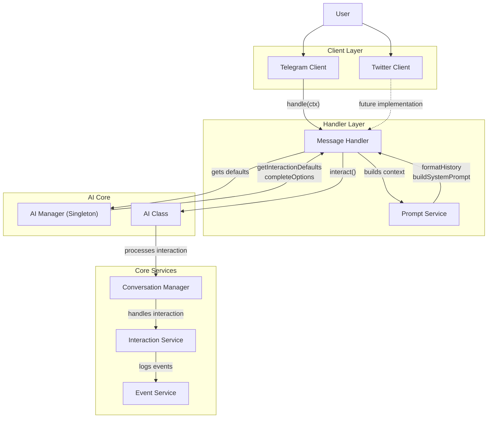
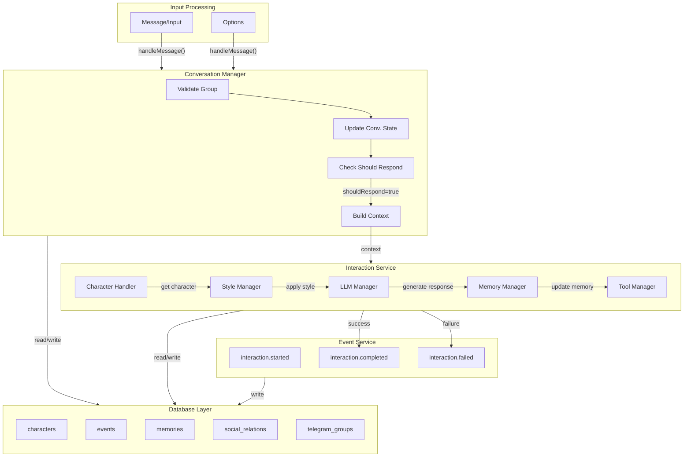
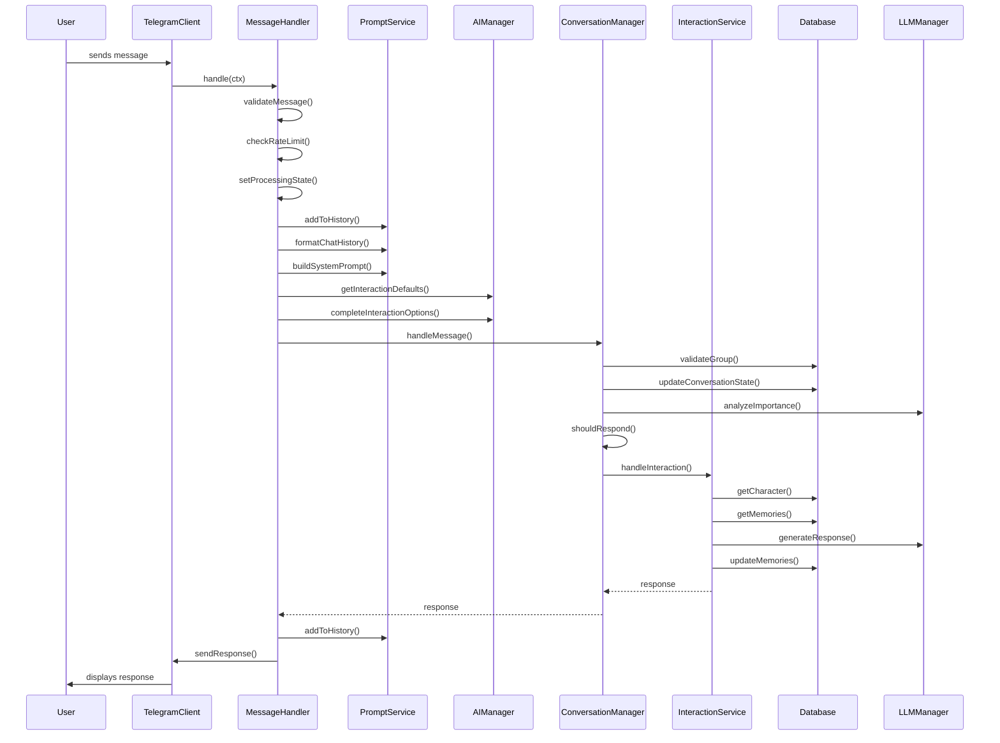

# Flows

```mermaid
flowchart TB
    subgraph Client["Client Layer"]
        TG["Telegram Client"]
        TW["Twitter Client"]
    end

    subgraph Handler["Handler Layer"]
        MH["Message Handler"]
        PS["Prompt Service"]
    end

    subgraph Core["AI Core"]
        AIM["AI Manager (Singleton)"]
        AI["AI Class"]
    end

    User --> TG
    User --> TW

    TG --> |"handle(ctx)"| MH
    TW -.-> |"future implementation"| MH

    MH --> |"builds context"| PS
    MH --> |"gets defaults"| AIM

    PS --> |"formatHistory\nbuildSystemPrompt"| MH
    AIM --> |"getInteractionDefaults\ncompleteOptions"| MH

    MH --> |"interact()"| AI

    subgraph Services["Core Services"]
        IS["Interaction Service"]
        ES["Event Service"]
        CM["Conversation Manager"]
    end

    AI --> |"processes interaction"| CM
    CM --> |"handles interaction"| IS
    IS --> |"logs events"| ES
```

# AI Class

```mermaid
flowchart TB
    subgraph Input["Input Processing"]
        MSG["Message/Input"]
        OPT["Options"]
    end

    subgraph ConversationManager["Conversation Manager"]
        CV["Validate Group"]
        CS["Update Conv. State"]
        SR["Check Should Respond"]
        CC["Build Context"]
    end

    subgraph InteractionService["Interaction Service"]
        CH["Character Handler"]
        ST["Style Manager"]
        LL["LLM Manager"]
        MM["Memory Manager"]
        TM["Tool Manager"]
    end

    subgraph EventService["Event Service"]
        EV1["interaction.started"]
        EV2["interaction.completed"]
        EV3["interaction.failed"]
    end

    MSG & OPT --> |"handleMessage()"| ConversationManager

    CV --> CS
    CS --> SR
    SR --> |"shouldRespond=true"| CC

    CC --> |"context"| InteractionService

    CH --> |"get character"| ST
    ST --> |"apply style"| LL
    LL --> |"generate response"| MM
    MM --> |"update memory"| TM

    InteractionService --> |"success"| EV2
    InteractionService --> |"failure"| EV3

    subgraph Database["Database Layer"]
        direction TB
        T1["characters"]
        T2["events"]
        T3["memories"]
        T4["social_relations"]
        T5["telegram_groups"]
    end

    ConversationManager --> |"read/write"| Database
    InteractionService --> |"read/write"| Database
    EventService --> |"write"| Database
```

# Manager Flow

```mermaid
sequenceDiagram
    participant U as User
    participant TC as TelegramClient
    participant MH as MessageHandler
    participant PS as PromptService
    participant AIM as AIManager
    participant CM as ConversationManager
    participant IS as InteractionService
    participant DB as Database
    participant LLM as LLMManager

    U->>TC: sends message
    TC->>MH: handle(ctx)

    MH->>MH: validateMessage()
    MH->>MH: checkRateLimit()
    MH->>MH: setProcessingState()

    MH->>PS: addToHistory()
    MH->>PS: formatChatHistory()
    MH->>PS: buildSystemPrompt()

    MH->>AIM: getInteractionDefaults()
    MH->>AIM: completeInteractionOptions()

    MH->>CM: handleMessage()

    CM->>DB: validateGroup()
    CM->>DB: updateConversationState()
    CM->>LLM: analyzeImportance()
    CM->>CM: shouldRespond()

    CM->>IS: handleInteraction()

    IS->>DB: getCharacter()
    IS->>DB: getMemories()
    IS->>LLM: generateResponse()
    IS->>DB: updateMemories()

    IS-->>CM: response
    CM-->>MH: response

    MH->>PS: addToHistory()
    MH->>TC: sendResponse()
    TC->>U: displays response
```
